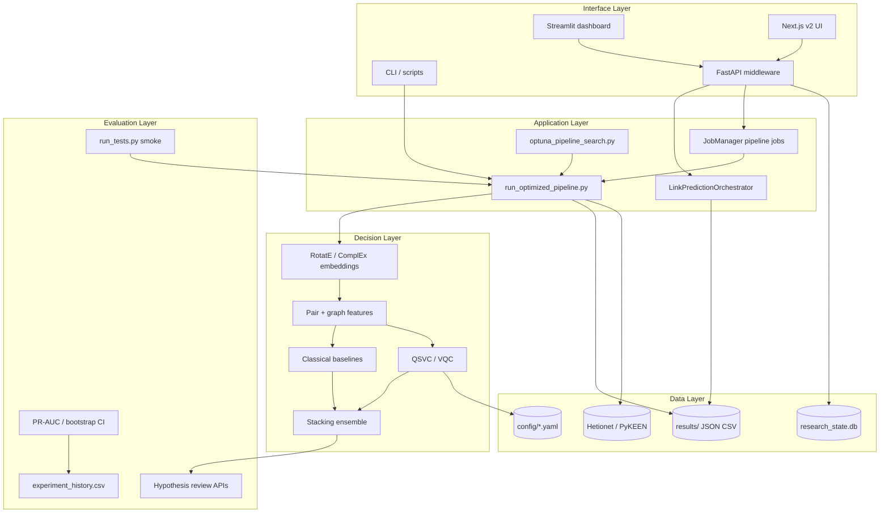
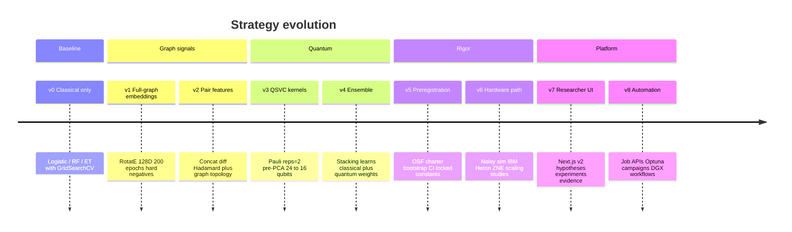
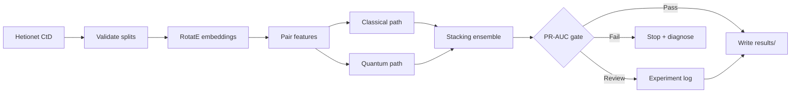
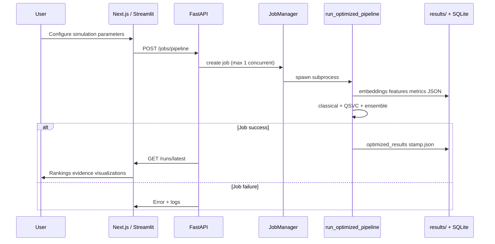
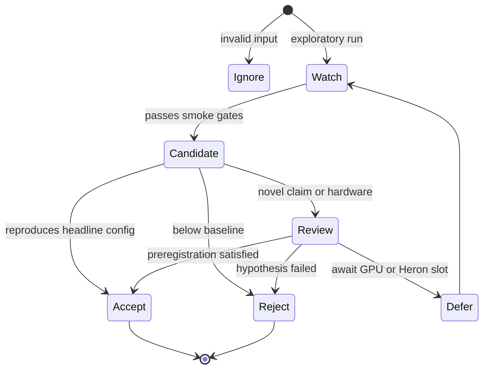
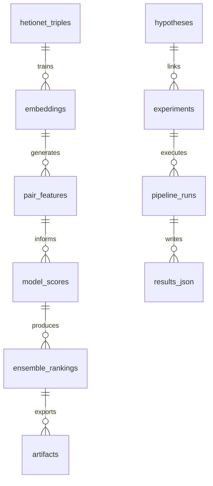
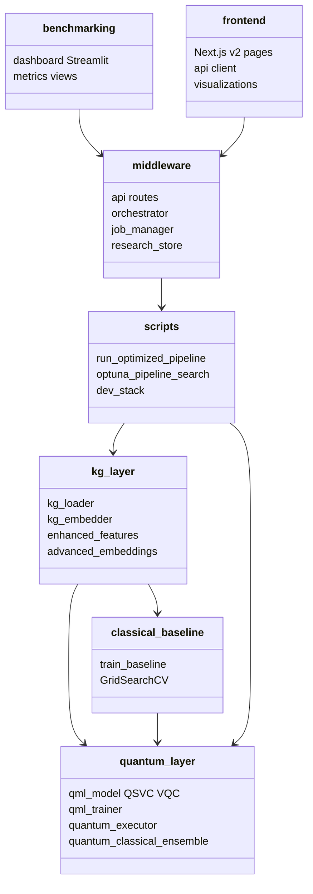
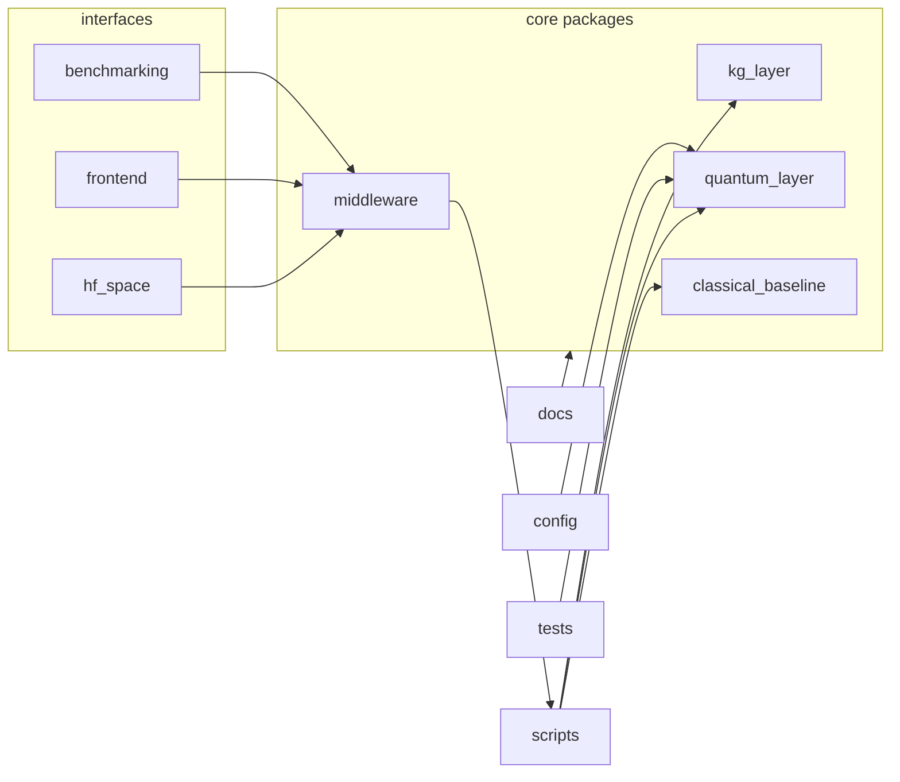

# Hybrid Quantum-Classical Knowledge Graph Link Prediction

A hybrid quantum-classical machine learning system for biomedical link prediction on the [Hetionet](https://het.io/) knowledge graph, predicting **Compound-treats-Disease (CtD)** relationships via classical ensembles and quantum kernel classifiers. Best test PR-AUC: **0.7987** (stacking ensemble with Pauli feature map).

## Reading Order

1. [Problem statement](#problem-statement)
2. [Project analysis](#project-analysis)
3. [Visual map](#visual-map)
4. [Architecture](#architecture)
5. [Strategy stack](#strategy-stack)
6. [Core pipeline](#core-pipeline)
7. [Data model](#data-model)
8. [Repository layout](#repository-layout)
9. [Quick start](#quick-start)
10. [Current phase](#current-phase)
11. [Visual reference](#visual-reference)

| Audience | Start Here |
|---|---|
| New reader | [Problem statement](#problem-statement) |
| Operator | [Current phase](#current-phase) and [Experiment runbook](docs/upcoming-execution/EXPERIMENT_RUNBOOK.md) |
| Engineer | [Architecture](#architecture) and [Repository layout](#repository-layout) |
| Researcher | [Strategy stack](#strategy-stack) and [Evaluation](#evaluation) |
| Diagrams | [Visual reference](#visual-reference) |

---

## Problem Statement

Biomedical knowledge graphs encode millions of relationships among compounds, diseases, genes, and pathways. **Drug repurposing** asks: given a compound and a disease with no known treatment edge, should we predict a new **Compound-treats-Disease (CtD)** link?

The challenge is scoring candidate pairs with:

- **High precision** under extreme class imbalance (most compound–disease pairs are negatives)
- **Grounded features** from graph structure and node embeddings
- **Traceable evaluation** (leakage-safe splits, PR-AUC, reproducible configs)
- **Hybrid modeling** that combines strong classical baselines with quantum kernel methods where they add signal

This repository implements the full pipeline—from Hetionet ingestion through RotatE embeddings, classical and quantum classifiers, stacking ensembles, dashboards, and APIs—targeting PR-AUC **> 0.70** on CtD link prediction.

---

## Project Analysis

Headline results on the CtD task (test set):

| Model | Test PR-AUC | Type |
|---|---:|---|
| Ensemble-QC-stacking (Pauli) | **0.7987** | Hybrid ensemble |
| RandomForest-Optimized | 0.7838 | Classical |
| ExtraTrees-Optimized | 0.7807 | Classical |
| Ensemble-QC-stacking (ZZ) | 0.7408 | Hybrid ensemble |
| QSVC-Optimized | 0.7216 | Quantum |

**Target PR-AUC > 0.70: achieved.**

Best configuration: full-graph **RotatE** embeddings (128D, 200 epochs), **hard** negative sampling, 16-qubit **Pauli** feature maps (reps=2), QSVC regularization (C=0.1), pre-PCA 24→16D, **stacking** ensemble with GridSearchCV-tuned classical models.

| Finding | Detail |
|---|---|
| Pauli vs ZZ | Pauli feature map lifts ensemble PR-AUC from 0.7408 → **0.7987** |
| Stacking | Learns optimal classical/quantum weights; manual `ensemble_quantum_weight` has no extra effect |
| Negatives | Hard negatives outperform diverse negatives in this configuration |
| VQC | Remains near random (best ~0.5474); **QSVC** is the effective quantum model |

Deeper variant log: [Experiment log](#experiment-log) · Full roadmap: [docs/roadmap/00_INDEX.md](docs/roadmap/00_INDEX.md)

---

## Visual Map

This project uses diagrams and generated charts to explain system behavior.

| Visual | Purpose |
|---|---|
| Architecture diagram | Five-layer system boundaries (interface → evaluation) |
| Pipeline diagram | Hetionet → embeddings → features → classical/quantum → ensemble |
| Sequence diagram | Dashboard/API → pipeline job → results store |
| State diagram | Experiment and review gates (draft → validated → published) |
| ER diagram | Research workflow tables and pipeline artifacts |
| Package diagram | `kg_layer`, `quantum_layer`, `classical_baseline`, `middleware` |
| Strategy timeline | Baseline → embeddings → quantum kernels → ensemble → hardware |
| Generated charts | Paper figures (`figures/fig*.py`), benchmark comparisons |

---

## Architecture

Hybrid QML-KG is organized into five layers:

| Layer | Responsibility |
|---|---|
| Interface | Streamlit dashboard, Next.js v2 UI, Gradio HF lite, CLI |
| Application | FastAPI routes, job orchestrator, pipeline scripts, Optuna search |
| Decision | KG embeddings, pair features, QSVC/VQC, classical models, stacking ensemble |
| Data | Hetionet files, `results/` artifacts, SQLite research store, config YAML |
| Evaluation | PR-AUC metrics, bootstrap CI, tests, experiment history, human review hooks |



Full component breakdown: [docs/ARCHITECTURE.md](docs/ARCHITECTURE.md) · UI/backend split: [docs/deployment/UI_BACKEND_ARCHITECTURE.md](docs/deployment/UI_BACKEND_ARCHITECTURE.md)

### Pipeline components

- **Knowledge graph** (`kg_layer/`): Hetionet ingestion, full-graph embedding training (RotatE, ComplEx, DistMult via PyKEEN), enhanced features, hard negative sampling.
- **Quantum layer** (`quantum_layer/`): QSVC with Pauli/ZZ feature maps, VQC with configurable ansatzes, kernel-target alignment, quantum–classical ensemble.
- **Classical baselines** (`classical_baseline/`): Logistic regression, random forest, extra trees with optional GridSearchCV.
- **Execution** (`quantum_layer/quantum_executor.py`): Statevector simulator, noisy Aer, GPU simulator (`--gpu`), IBM Quantum Heron.
- **Interfaces**: Streamlit (`benchmarking/dashboard.py`), Next.js (`frontend/`), FastAPI (`middleware/api.py`), Gradio HF lite (`hf_space/app.py`).

---

## Strategy Stack

The modeling strategy is cumulative: later layers extend earlier safety checks rather than replacing them.



Research positioning and timeline: [charter/01_phase_alignment.md](charter/01_phase_alignment.md) · Gap analysis: [docs/roadmap/02_scientific_gaps.md](docs/roadmap/02_scientific_gaps.md)

---

## Core Pipeline

The project follows a repeatable input-to-output pipeline for CtD link prediction.

| Step | Purpose | Output |
|---|---|---|
| Ingest | Load Hetionet; extract CtD edges | Raw triples and entity index |
| Validate | Leakage checks, split integrity, schema | Train/val/test partitions |
| Transform | Train full-graph embeddings; build pair features | Embedding matrix, feature vectors |
| Analyze | Train classical + quantum classifiers | Per-model score vectors |
| Score | Stacking ensemble; rank candidate pairs | PR-AUC, probability scores |
| Review | Hypothesis-linked runs; operator inspection | Approved experiment record |
| Output | JSON rankings, CSV history, dashboard artifacts | `optimized_results_*.json` |



### Key pipeline flags

| Flag | Description | Best-run value |
|---|---|---|
| `--full_graph_embeddings` | Train on all Hetionet relations | Enabled |
| `--embedding_method` | KG embedding algorithm | `RotatE` |
| `--embedding_dim` | Embedding dimensionality | `128` |
| `--embedding_epochs` | Embedding training epochs | `200` |
| `--negative_sampling` | Negative sampling strategy | `hard` |
| `--qml_dim` | Qubits / quantum feature dimension | `16` |
| `--qml_feature_map` | Feature map type | `Pauli` |
| `--qml_feature_map_reps` | Feature map repetitions | `2` |
| `--qsvc_C` | QSVC regularization | `0.1` |
| `--run_ensemble` | Enable quantum–classical ensemble | Enabled |
| `--ensemble_method` | Ensemble strategy | `stacking` |
| `--tune_classical` | GridSearchCV for classical models | Enabled |
| `--qml_pre_pca_dim` | Pre-PCA dimensionality | `24` |
| `--optimize_feature_map_reps` | Auto-select reps via kernel alignment | Enabled |

### Execution modes

```bash
# CPU simulator (default)
python scripts/run_optimized_pipeline.py --relation CtD ...

# GPU-accelerated simulation (requires qiskit-aer-gpu)
python scripts/run_optimized_pipeline.py --relation CtD --gpu ...

# DGX Spark (auto-detected)
HYBRID_QML_SYSTEM=dgx python scripts/run_optimized_pipeline.py --relation CtD ...

# Explicit config file
python scripts/run_optimized_pipeline.py --quantum_config_path config/quantum_config_gpu.yaml ...
```

All GPU paths fall back to CPU if no GPU is detected.

### Hyperparameter search (Optuna)

```bash
python scripts/optuna_pipeline_search.py --n_trials 30 --objective ensemble
python scripts/optuna_pipeline_search.py --n_trials 20 --objective qsvc
python scripts/optuna_pipeline_search.py --n_trials 20 --objective classical
```

Outputs: `results/optuna/optuna_trials.csv`, `results/optuna/optuna_best.json`

---

## Runtime Flow

Typical researcher workflow through the API and UI:



Local dev stack (aligned API + Next ports): `./scripts/dev_stack.sh`

---

## Decision States

Experiment and pipeline outcomes follow explicit gates:

| State | Meaning | Action |
|---|---|---|
| Ignore | Invalid config or no signal | Stop and log |
| Watch | Weak signal; monitor only | Track in experiment history |
| Candidate | Passes baseline PR-AUC threshold | Score and compare variants |
| Review | Needs operator or author decision | Route to hypothesis / charter review |
| Accept | Meets confidence and reproducibility gates | Publish artifact or promote config |
| Reject | Fails validation or risk threshold | Block and document |
| Defer | Missing data or hardware unavailable | Retry on DGX / Heron |



Locked methodology constants: [utils/preregistered_constants.py](utils/preregistered_constants.py) · Bootstrap decision rule: [utils/bootstrap_ci.py](utils/bootstrap_ci.py)

---

## Data Model

The data model preserves traceability from raw graph input to ranked predictions and researcher workflow state.

| Entity / store | Purpose |
|---|---|
| Hetionet TSV / PyKEEN triples | Source graph and training triples |
| `results/optimized_results_*.json` | Full run config, rankings, classical/quantum/ensemble metrics |
| `results/latest_run.csv` | Most recent run summary |
| `results/experiment_history.csv` | Cross-run experiment log |
| `results/research_state.db` | Hypotheses, experiments, v2 research sessions |
| `results/optuna/` | Optuna trial CSV and best-config JSON |
| `artifacts/predictions/` | Repurposing reports and top candidates |
| Pipeline logs | Terminal output, DGX logs under `results/` |



SQLite schema: [middleware/research_store.py](middleware/research_store.py)

---

## Package Boundaries

The codebase separates graph ingestion, quantum/classical modeling, orchestration, and operations.



---

## Repository Layout

```text
hybrid-qml-kg-poc/
├── README.md
├── kg_layer/                    # Hetionet load, embeddings, features
├── quantum_layer/               # QSVC, VQC, executor, ensemble
├── classical_baseline/          # Classical ML baselines
├── middleware/                  # FastAPI, orchestrator, job manager, stores
├── benchmarking/                # Streamlit dashboard
├── frontend/                    # Next.js v2 researcher UI (in migration)
├── scripts/                     # Pipeline, Optuna, dev_stack, DGX wrappers
├── config/                      # quantum_config*.yaml backends
├── tests/                       # Quantum improvements + synthetic KG fixtures
├── utils/                       # evaluation, bootstrap CI, reproducibility
├── docs/                        # Architecture, roadmap, deployment, papers
├── charter/                     # Phase alignment, scope, methodology gates
├── preregistration/             # OSF preregistration v1
├── figures/                     # Paper figure generators (fig1–fig3)
├── hf_space/                    # Gradio HF lite shell
├── results/                     # Pipeline outputs (gitignored artifacts)
├── requirements.txt             # Dashboard / lightweight deps
├── requirements-full.txt        # Full pipeline deps
└── run_tests.py                 # Terminal + dashboard test harness
```



Directory guide: [docs/guides/DIRECTORY_GUIDE.md](docs/guides/DIRECTORY_GUIDE.md)

---

## Quick Start

### Installation

```bash
git clone https://github.com/Quantum-Global-Group/hybrid-qml-kg-poc.git
cd hybrid-qml-kg-poc

python -m venv .venv
source .venv/bin/activate

# Dashboard and lightweight runs
pip install -r requirements.txt

# Full pipeline (PyTorch, PyKEEN, embedding training)
pip install -r requirements-full.txt
```

### Reproduce the best result

```bash
python scripts/run_optimized_pipeline.py --relation CtD \
  --full_graph_embeddings --embedding_method RotatE --embedding_dim 128 \
  --embedding_epochs 200 --negative_sampling hard --qml_dim 16 \
  --qml_feature_map Pauli --qml_feature_map_reps 2 --qsvc_C 0.1 \
  --optimize_feature_map_reps --run_ensemble --ensemble_method stacking \
  --tune_classical --qml_pre_pca_dim 24 --fast_mode
```

For robust evaluation (K-fold CV, no `fast_mode`): add `--use_cv_evaluation --cv_folds 5`. For paper-ready runs: add `--run_multimodel_fusion --fusion_method bayesian_averaging` and omit `--fast_mode`. See [docs/reference/TEST_COMMANDS.md](docs/reference/TEST_COMMANDS.md).

### NVIDIA DGX Spark (full-graph embedding)

Install CUDA-enabled PyTorch, then from repo root:

```bash
./scripts/run_full_embedding_dgx.sh
```

Details: [docs/deployment/DGX_SPARK.md](docs/deployment/DGX_SPARK.md)

### Launch interfaces

```bash
# Streamlit dashboard (default port 8501)
streamlit run benchmarking/dashboard.py
# Or: ./scripts/launch_dashboard.sh

# FastAPI (dev port 8780) + Next.js together
./scripts/dev_stack.sh

# API only
uvicorn middleware.api:app --reload --host 127.0.0.1 --port 8780

# Gradio HF lite shell (default 7860)
./scripts/run_hf_lite.sh
```

**IBM Quantum (BYOK):** `POST /quantum/runtime/verify` performs a one-time connectivity check; credentials are not persisted by default. Configure tenant-scoped tokens via `/settings` or `/config/ibm-quantum`. Deploy the API behind HTTPS in production.

### Tests and smoke checks

```bash
python run_tests.py --mode terminal          # Quantum test suite
python scripts/e2e_smoke.py                  # End-to-end smoke (< 3 min)
```

---

## Current Phase

**Status (2026 Q2):** Headline result achieved (PR-AUC **0.7987**); focus is **publication-ready evidence**, **hardware validation**, and **Next.js UI parity**.

| Tier | Focus | Examples |
|---|---|---|
| **1 — Blocks arXiv v2** | Missing paper v2 experiments | MoA benchmark, CpD run, multi-seed eval, figure renders, baseline table fixes |
| **2 — Quantum claim** | Ablations and hardware | 4-condition ablation matrix, KTA diagnostic, noisy sim, IBM Heron benchmark |
| **3 — Frontend parity** | Researcher workflow in Next.js | Pipeline jobs from UI, MoA panel, benchmark registry, experiment history chart |
| **4 — Platform** | Longer-term extensions | ClinicalTrials API, multi-relational edges, DRKG, Nyström at scale |

Full prioritized backlog: [docs/roadmap/00_INDEX.md](docs/roadmap/00_INDEX.md)

**Operator runbooks**

| Runbook | Use when |
|---|---|
| [docs/upcoming-execution/EXPERIMENT_RUNBOOK.md](docs/upcoming-execution/EXPERIMENT_RUNBOOK.md) | Phase-specific experiment commands, ML-Intern quantum jobs |
| [docs/deployment/DGX_SPARK.md](docs/deployment/DGX_SPARK.md) | CUDA embedding training on DGX |
| [docs/deployment/DGX_BOOTSTRAP_CI.md](docs/deployment/DGX_BOOTSTRAP_CI.md) | GPU Aer bootstrap CI for H1/H1b |
| [docs/deployment/FLY_IO.md](docs/deployment/FLY_IO.md) | Combined Next + FastAPI Fly deployment |

---

## Evaluation

Model comparison uses **PR-AUC** on held-out CtD pairs. The Pauli stacking ensemble is the headline configuration.

Regenerate paper figures from repo root:

```bash
.venv/bin/python figures/fig1_pipeline.py
.venv/bin/python figures/fig2_pauli_zz.py
.venv/bin/python figures/fig3_clinical.py
```

Evidence and sensitivity writeups: [docs/RESULTS_EVIDENCE.md](docs/RESULTS_EVIDENCE.md) · [docs/results/sensitivity_pauli_vs_zz.md](docs/results/sensitivity_pauli_vs_zz.md)

### Experiment log

| Variant | RF | ET | QSVC | Ensemble | Notes |
|---|---:|---:|---:|---:|---|
| Base (200 ep, stacking, tune, pre-PCA 24) | 0.7838 | 0.7807 | 0.7216 | 0.7408 | Best classical |
| + Pauli feature map (reps=2) | 0.7838 | 0.7807 | 0.6343 | **0.7987** | Best ensemble |
| + diverse negatives (dw=0.5) | 0.7144 | 0.7298 | 0.6689 | 0.6919 | Diverse hurts here |
| + qsvc_C=0.05 | 0.7838 | 0.7807 | 0.7216 | 0.7408 | Same as C=0.1 |
| + ensemble_quantum_weight=0.4 | 0.7838 | 0.7807 | 0.7216 | 0.7408 | Stacking learns weights |

---

## Reproducibility and Preregistration

The repository ships OSF-style preregistration, charter gates, locked constants, bootstrap CI, and a synthetic-KG fixture for CI without Hetionet downloads.

| Artifact | Purpose |
|---|---|
| [preregistration/osf_preregistration_v1.md](preregistration/osf_preregistration_v1.md) | OSF preregistration §1–12 (retroactive disclosure) |
| [charter/01_phase_alignment.md](charter/01_phase_alignment.md) | Research positioning, audience, timeline |
| [charter/02_scope_decisions.md](charter/02_scope_decisions.md) | Forward scope: edge types, baselines, hardware |
| [charter/03_methodology_decisions.md](charter/03_methodology_decisions.md) | Headline configuration reconciliation |
| [utils/preregistered_constants.py](utils/preregistered_constants.py) | Locked thresholds (amendment via §12) |
| [utils/bootstrap_ci.py](utils/bootstrap_ci.py) | Paired-bootstrap PR-AUC CI, conjunction rule |
| [tests/fixtures/synthetic_kg.py](tests/fixtures/synthetic_kg.py) | Deterministic synthetic KG for smoke tests |

Preregistration is **retroactive**: H1/H1b were formalized after PR-AUC 0.7987 was observed. H2/H3 (hardware) remain blinded where applicable.

---

## Documentation

| Document | Description |
|---|---|
| [docs/README.md](docs/README.md) | Index of all documentation |
| [docs/ARCHITECTURE.md](docs/ARCHITECTURE.md) | Component diagram and module reference |
| [docs/TECHNICAL_PAPER.md](docs/TECHNICAL_PAPER.md) | Methods, results, discussion |
| [docs/planning/NEXT_STEPS_TO_IMPROVE_PERFORMANCE.md](docs/planning/NEXT_STEPS_TO_IMPROVE_PERFORMANCE.md) | Experiment log and optimization roadmap |
| [docs/overview/IMPLEMENTATION_RECAP.md](docs/overview/IMPLEMENTATION_RECAP.md) | Pipeline improvements and GPU readiness |
| [docs/deployment/DEPLOY_HUGGINGFACE.md](docs/deployment/DEPLOY_HUGGINGFACE.md) | Hugging Face Spaces deployment |
| [docs/HF_VENTURE.md](docs/HF_VENTURE.md) | HF lite initiative positioning |
| [docs/WHY_QUANTUM_UNDERPERFORMS.md](docs/WHY_QUANTUM_UNDERPERFORMS.md) | Quantum–classical performance gap analysis |

Live dashboard: [Hugging Face Spaces — QGG-HYBRID-PROJECT](https://huggingface.co/spaces/rocRevyAreGoals15/QGG-HYBRID-PROJECT)

---

## Requirements

- Python 3.9+
- 8 GB RAM minimum (16 GB recommended for 16-qubit runs)
- Optional: NVIDIA GPU with CUDA for accelerated quantum simulation
- Optional: IBM Quantum account for hardware execution (see `.env.example`: `IBM_Q_TOKEN`, `IBM_QUANTUM_INSTANCE`)

| File | Scope |
|---|---|
| `requirements.txt` | Dashboard and lightweight local runs |
| `requirements-full.txt` | Full pipeline including PyTorch and PyKEEN |
| `requirements-gpu.txt` | Optional Aer GPU packages (after `requirements-full.txt`) |

---

## Visual Reference

| Visual | Section |
|---|---|
| Five-layer architecture | [Architecture](#architecture) |
| CtD pipeline | [Core pipeline](#core-pipeline) |
| API / job sequence | [Runtime flow](#runtime-flow) |
| Experiment gates | [Decision states](#decision-states) |
| Stores and artifacts | [Data model](#data-model) |
| Code packages | [Package boundaries](#package-boundaries) |
| Directory map | [Repository layout](#repository-layout) |
| Strategy timeline | [Strategy stack](#strategy-stack) |
| PR-AUC tables and figures | [Evaluation](#evaluation) |

Deeper diagrams belong in [docs/ARCHITECTURE.md](docs/ARCHITECTURE.md) and [docs/roadmap/](docs/roadmap/) when README length grows.

---

## License

MIT — confirm with all co-authors before publication. Full text: [LICENSE](LICENSE).

---

## Publication Metadata (provisional)

Venue order, OSF/manuscript dates, affiliations, and ORCIDs are flagged *provisional* in [preregistration/osf_preregistration_v1.md](preregistration/osf_preregistration_v1.md) and [charter/01_phase_alignment.md](charter/01_phase_alignment.md) until authors finalize.

---

## Citation

```bibtex
@software{hybrid_qml_kg,
  title  = {Hybrid Quantum-Classical Knowledge Graph Link Prediction},
  year   = {2026},
  url    = {https://github.com/Quantum-Global-Group/hybrid-qml-kg-poc}
}
```

---

## Acknowledgments

- [Hetionet](https://het.io/) biomedical knowledge graph
- [IBM Quantum](https://quantum.ibm.com/) and the Qiskit community
- [PyKEEN](https://pykeen.github.io/) for knowledge graph embedding training
