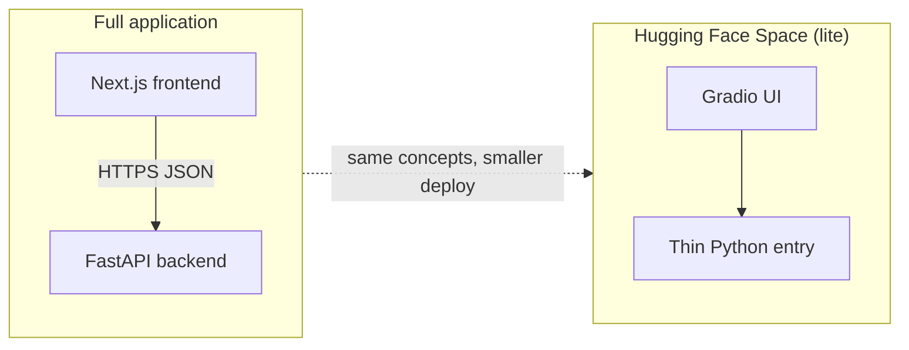
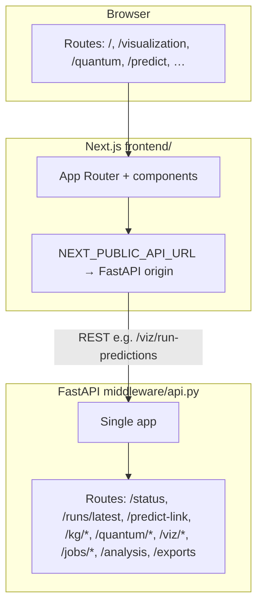
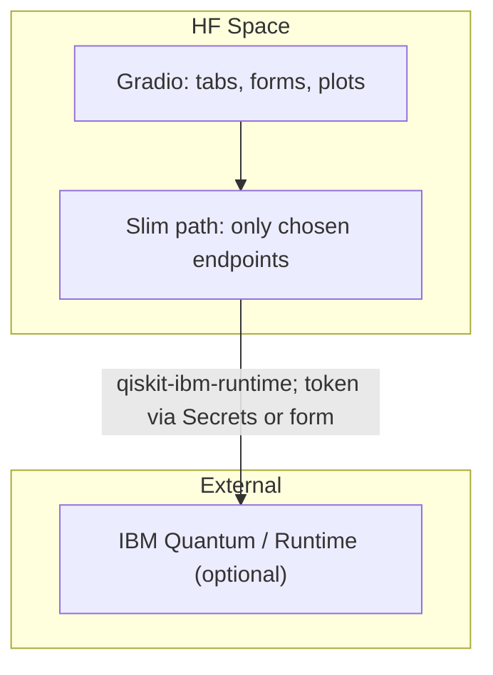
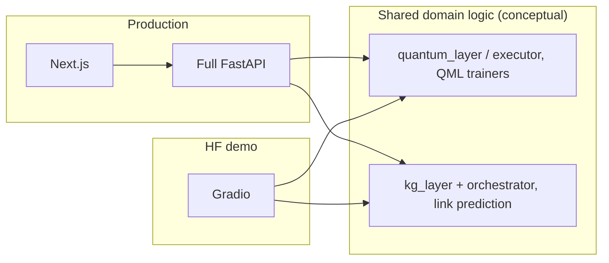

# Hugging Face Spaces — lite deployment blueprint

This document specifies **what will be implemented** for a **Hugging Face lite** demo: scope, backend routes, UI approach, phased delivery, and architecture diagrams. Venture framing is in [`../HF_VENTURE.md`](../HF_VENTURE.md).

---

## Goals

- **Reuse** the same domain stack (`middleware/api.py`, `quantum_layer/`, `kg_layer/`, orchestrator) where practical—behavior parity for chosen routes, not a second product logic fork.
- **Avoid** full Next.js on the Space by default (heavy build); use **Gradio** (or Streamlit) as the shell.
- **Fit** free-tier Spaces: CPU-first, bounded requests, **small** baked artifacts for `data/`, `models/`, `results/` (same class of decisions as [`FLY_IO.md`](FLY_IO.md)).

---

## Architecture (conceptual)

### Full application vs HF lite

### Full stack (this monorepo)

Local full stack: `./scripts/dev_stack.sh` (API default **8780**, Next **3780**). Production full stack: see [`FLY_IO.md`](FLY_IO.md) and `frontend/next.config.mjs` rewrites.

### HF lite (Gradio + slim path)

### Shared logic, two shells

Prefer **importing** shared modules over duplicating; the Gradio app should call a **documented subset** of HTTP handlers or shared Python entrypoints.

---

## Scope tiers (what goes into the lite base)

Mapping to the main product’s navigation tasks (`frontend/lib/nav.ts`).

### Tier A — Base (ship first)

| Area | Intent | FastAPI endpoints |
|------|--------|-------------------|
| System | Health / loaded models | `GET /status` |
| Results | Anchor demo on a real run | `GET /runs/latest` |
| Results | One-screen experiment summary | `GET /analysis/summary` |
| Quantum | Show config | `GET /quantum/config` |
| Quantum | IBM Runtime / BYOK check | `POST /quantum/runtime/verify` |

**Secrets:** IBM API tokens must **not** be committed. Use Hugging Face Space **Secrets** (e.g. `IBM_Q_TOKEN`, `IBM_QUANTUM_INSTANCE`) or user-supplied ephemeral input; align with README guidance for BYOK.

### Tier B — Visualizer slice (second milestone)

Aligns with **Visualizer** (`/visualization`) in the main app; expose only what fits CPU/memory.

| Theme | Endpoints | Notes |
|-------|-----------|--------|
| Predictions / leaderboard | `GET /viz/run-predictions`, `GET /viz/predictions` | Requires curated `results/` |
| Model comparison | `GET /viz/model-metrics` | Usually lightweight JSON |
| Quantum circuit | `GET /viz/circuit-params` | High value for QML narrative |
| Molecule | `GET /viz/molecule` | Include if 3D deps fit image; else defer |
| KG | `GET /viz/kg-search`, `GET /viz/kg-subgraph` | Use strict limits (`top_k`, depth) |
| Embeddings plot | `GET /viz/embeddings` | Optional; may downsample |
| Feature vector | `GET /viz/embedding-vector` | Optional after Tier B core |

Optional panel: `GET /kg/stats` for aggregate KG stats.

### Tier C — Interactive prediction (optional third milestone)

| Main product | Endpoints | Notes |
|--------------|-----------|--------|
| Predict treatment | `POST /predict-link` (and `GET` if used) | Requires orchestrator + models + KG resolution in-container |
| Ranked candidates | `POST /ranked-mechanisms` | Only if hypotheses story is in scope |

### Out of scope for v1 lite

| Feature | Reason |
|---------|--------|
| `POST /jobs/pipeline`, `GET /jobs/*` | Long-running; wrong default for free Space |
| Full **New run** / simulation parity | Train locally or on Fly / HF Jobs |
| Full **export** browser | Nice-to-have later |
| Full Next.js app inside Space | Possible via Docker but heavy; not the default plan |

---

## Phased implementation plan

| Phase | Deliverable |
|-------|-------------|
| **1 — Contract** | Freeze Tier A + list of Tier B tabs; max image size and timeout assumptions documented in Space README. |
| **2 — Backend** | Run **same** `middleware.api:app` (recommended for parity) *or* a small FastAPI that mounts only needed routes. Decide single-process layout (Gradio + uvicorn or chained). |
| **3 — Artifacts** | Curate minimal `data/`, `models/`, `results/`; validate cold start (`/status`, `/runs/latest`, one `/viz/*`). |
| **4 — Gradio UI** | Tabs: Status + latest + analysis; Quantum (config + verify); Visualizer lite per Tier B. |
| **5 — Packaging** | `requirements.txt` **subset** (avoid full training stack unless required). Dockerfile or Gradio SDK; HF README; secrets documented. |
| **6 — Validation** | Smoke script or checklist: `/status` → `/runs/latest` → `/viz/...` → optional `verify`. |

---

## Comparison table (full app vs HF lite)

| | **Full app** | **HF lite** |
|---|--------------|-------------|
| **UI** | Next.js (`frontend/`) | Gradio (default) |
| **Backend** | Full FastAPI | Same app or route subset: Tier A–C only |
| **Deploy** | Fly / Docker / local `dev_stack.sh` | Hugging Face Space |
| **Goal** | Product + labs | Researcher demo; free-tier friendly |

---

## Repository artifacts (implemented)

| Path | Purpose |
|------|---------|
| [`hf_space/app.py`](../../hf_space/app.py) | Gradio UI; in-process `TestClient` → `middleware.api:app` |
| [`hf_space/requirements.txt`](../../hf_space/requirements.txt) | Slim deps for the Space (not the full root lockfile) |
| [`hf_space/README.md`](../../hf_space/README.md) | Hub README template (`app_file: hf_space/app.py` when the full repo is the Space) |
| [`scripts/run_hf_lite.sh`](../../scripts/run_hf_lite.sh) | Local launch: `PYTHONPATH=.` + `python hf_space/app.py` |

**Secrets:** do not commit tokens. On the Hub, set `IBM_Q_TOKEN` and optionally `IBM_QUANTUM_INSTANCE` (see `hf_space/README.md`).

Phases **1–5** from the table above are partially satisfied by this scaffold; **Phase 6** (automated smoke on CI) is still optional.

If the Space repository is **only** the contents of `hf_space/` copied to root, rename `app.py` at the Space root and set `app_file: app.py` in the Space README.

---

## Related links

- [`HF_VENTURE.md`](../HF_VENTURE.md) — audience and success criteria.
- [`FLY_IO.md`](FLY_IO.md) — full-stack deploy; data/model bundling patterns.
- [`DEPLOY_HUGGINGFACE.md`](DEPLOY_HUGGINGFACE.md) — existing **Streamlit** dashboard push workflow to Spaces (today’s Hub path); the lite plan above targets **Gradio + API subset** as a separate evolution—coordinate so two Spaces or one unified Dockerfile do not conflict.
- [`../frontend/lib/nav.ts`](../../frontend/lib/nav.ts) — main product IA.
- [`../../middleware/api.py`](../../middleware/api.py) — source of truth for routes.
