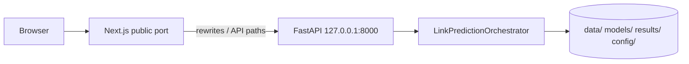

# UI and backend architecture (hosting-oriented)

This document describes how the **Next.js** frontend and **FastAPI** backend fit together, which **files and artifacts** they need at runtime, and which **dependencies** apply when you host the stack yourself or in containers.

For platform-specific steps (e.g. Fly.io), see [FLY_IO.md](./FLY_IO.md).

---

## 1. Components at a glance

| Layer | Location | Role |
|--------|-----------|------|
| **Next.js UI** | `frontend/` | App Router UI: experiments, visualization, predict, quantum pages, etc. Talks to the API via `NEXT_PUBLIC_API_URL` (or same-origin proxy in production). |
| **FastAPI backend** | `middleware/api.py` | REST API: `/status`, `/runs/latest`, `/predict-link`, visualization endpoints under `/viz/*`, pipeline jobs, IBM Quantum verify, etc. |
| **Orchestration** | `middleware/orchestrator.py` | Loads KG/embeddings and classical/quantum predictors; shared by the API. |
| **Streamlit dashboard** (optional) | `benchmarking/dashboard.py` | Legacy/narrative benchmark UI; **not** required for Next.js. Often deployed separately (e.g. Hugging Face Spaces). |

Local development defaults (see `scripts/dev_stack.sh` and `frontend/.env.example`):

- **API:** `http://127.0.0.1:8780`
- **Next.js:** `http://localhost:3780`

---

## 2. How the browser reaches the backend

### 2.1 Development (two processes)

1. **FastAPI** listens on a chosen host/port (default **8780**).
2. **Next.js** dev server listens on another port (default **3780**).
3. The browser loads the Next app. Client code in `frontend/lib/api.ts` builds URLs as `NEXT_PUBLIC_API_URL + path` (e.g. `http://127.0.0.1:8780/status`).

Set `NEXT_PUBLIC_API_URL` in `frontend/.env.local` to match the API; restart Next after changing it.

### 2.2 Production-style single origin (recommended for hosting)

`frontend/next.config.mjs` defines a **fallback rewrite**: any path that Next does not handle is forwarded to the API origin derived from `NEXT_PUBLIC_API_URL`.

- If `NEXT_PUBLIC_API_URL` is **empty** at **build time**, the config treats the API as same-origin; the UI calls relative URLs and Next proxies to FastAPI (see root `Dockerfile` which runs `NEXT_PUBLIC_API_URL="" pnpm build`).
- Typical container pattern: run **uvicorn on `127.0.0.1:8000`** (not public) and **Next.js on `0.0.0.0:$PORT`** (public). Only Next is exposed; API stays on loopback.



---

## 3. Backend: Python layout and responsibilities

### 3.1 Entry point

- **ASGI app:** `middleware.api:app` (uvicorn).
- **CORS:** enabled broadly in `middleware/api.py`; for production, restrict `allow_origins` to your UI origin(s).

### 3.2 Code packages copied into API images

`deployment/Dockerfile.api` copies (conceptually what the API needs on disk):

| Path | Purpose |
|------|---------|
| `middleware/` | FastAPI routes, job manager, orchestrator wiring |
| `kg_layer/` | Hetionet loading, embeddings, KG utilities |
| `quantum_layer/` | QSVC/VQC and quantum execution |
| `classical_baseline/` | Classical predictors |
| `utils/` | e.g. latest run snapshot, IBM runtime verify |
| `config/` | YAML including `config/quantum_config*.yaml` |

### 3.3 Runtime data the API expects

The orchestrator and routes assume repository-relative paths such as:

- **`data/`** — entity embeddings, Hetionet metadata, etc.
- **`models/`** — trained classical artifacts (e.g. `.joblib`), scalers
- **`results/`** — pipeline outputs; `/runs/latest` reads from here
- **`config/`** — quantum and app configuration

`deployment/docker-compose.yml` mounts these from the host into the API container. If you deploy without volumes, you must **bake** the needed files into the image or seed a volume (see [FLY_IO.md](./FLY_IO.md) “Critical: data, models, and results”).

### 3.4 Python dependencies

| Use case | File / approach |
|----------|------------------|
| **Local / generic API + dashboard** | Root **`requirements.txt`** — full pinned set used by Streamlit and tooling (large). |
| **`deployment/Dockerfile.api`** | Installs **`requirements.txt`** at build time. |
| **Root `Dockerfile` (Next + API combined)** | Installs **`requirements-huggingface.txt`** plus explicit `pip` lines for FastAPI, uvicorn, qiskit-algorithms (slimmer image oriented toward HF-style deploys). **Behavior may differ** from the full `requirements.txt` stack; validate endpoints you need. |
| **Full ML pipeline (PyKEEN, training)** | **`requirements-full.txt`** — not required only to *serve* the API if artifacts already exist. |

Environment variables commonly used in production (examples):

- **`IBM_QUANTUM_TOKEN`** (or docs mention `IBM_Q_TOKEN`) — only if you expose IBM Quantum features; see API and config.

---

## 4. Frontend: Next.js layout and dependencies

### 4.1 Tooling

- **Package manager:** **pnpm** (lockfile: `frontend/pnpm-lock.yaml`).
- **Node:** compatible with **Node 20** (root `Dockerfile` installs Node 20).

### 4.2 Key directories and files

| Path | Role |
|------|------|
| `frontend/app/` | App Router pages (`page.tsx`, `layout.tsx`, route segments). |
| `frontend/lib/api.ts` | Typed fetch helpers for FastAPI (`/status`, `/runs/latest`, `/predict-link`, `/viz/*`, jobs, etc.). |
| `frontend/lib/nav.ts` | Navigation metadata for the shell. |
| `frontend/next.config.mjs` | Rewrites + `serverComponentsExternalPackages` for `three`, `d3`, `chart.js`. |
| `frontend/tsconfig.json`, `frontend/eslint.config.mjs` | TS and lint config. |

### 4.3 npm dependencies (from `frontend/package.json`)

**Runtime (`dependencies`):**

- `next` **16.2.3**
- `react` **19.2.5**, `react-dom` **19.2.5**
- `chart.js`, `d3`, `three` — charts, graph/layout, 3D/visualization

**Development (`devDependencies`):**

- `typescript`, `@types/*`, `tailwindcss`, `postcss`, `autoprefixer`, `eslint`, `eslint-config-next`

Install:

```bash
cd frontend && pnpm install
```

Build and run (after setting env):

```bash
cd frontend && pnpm build && pnpm start
```

### 4.4 Environment variables (Next.js)

| Variable | Purpose |
|----------|---------|
| **`NEXT_PUBLIC_API_URL`** | Base URL for the FastAPI server **without** a trailing slash. In dev: e.g. `http://127.0.0.1:8780`. For same-origin production builds, often **empty** so rewrites/proxy apply. |

Copy `frontend/.env.example` to `frontend/.env.local` for local overrides.

---

## 5. Docker and compose (reference)

### 5.1 `deployment/docker-compose.yml`

- **`kg-api`:** builds `deployment/Dockerfile.api`; maps host **8780** → container **8000**; mounts `data`, `models`, `results`, `config`.
- **`dashboard`:** Streamlit on **8501** (separate from Next.js).
- **`notebooks`:** optional Jupyter (dev).

This compose file does **not** build the Next.js frontend; use `scripts/dev_stack.sh` or a custom image for Next.

### 5.2 Root `Dockerfile` (combined Next + FastAPI)

- Installs Node 20 + pnpm, Python deps from `requirements-huggingface.txt` (+ extra pip lines), builds `frontend/` with `NEXT_PUBLIC_API_URL=""`, copies the project, exposes **8080** (image default `PORT`; HF/Fly may override), starts uvicorn on **127.0.0.1:8000** and `next start` on **`${PORT:-8080}`**.

Adjust **`CMD`** and **`PORT`** when deploying to platforms that inject `PORT` (see [FLY_IO.md](./FLY_IO.md)).

### 5.3 `deployment/Dockerfile.dashboard`

Streamlit-only image for `benchmarking/dashboard.py` — useful when you want the benchmark UI without Next.js.

---

## 6. Minimal checklist for hosting “UI + backend”

1. **Run FastAPI** with `data/`, `models/`, `results/`, and `config/` available at the paths expected by the code (mount or bake).
2. **Build Next.js** with the correct **`NEXT_PUBLIC_API_URL`** for your routing model (split dev URLs vs empty for single-origin).
3. **Expose** only the Next.js listener if using the proxy pattern; terminate TLS at your reverse proxy or platform edge.
4. **Tighten CORS** and restrict origins in `middleware/api.py` for production.
5. **Do not commit secrets**; inject tokens via environment at runtime.

---

## 7. Related scripts

| Script | Purpose |
|--------|---------|
| `scripts/dev_stack.sh` | Starts FastAPI + Next with matching `NEXT_PUBLIC_API_URL`. |
| `uvicorn middleware.api:app --reload --host 127.0.0.1 --port 8780` | API only. |
| `streamlit run benchmarking/dashboard.py` | Streamlit dashboard only (port 8501). |

This should be enough to reason about file layout, dependencies, and hosting options for the **Next.js + FastAPI** stack; optional Streamlit and full training pipelines are separate concerns.
