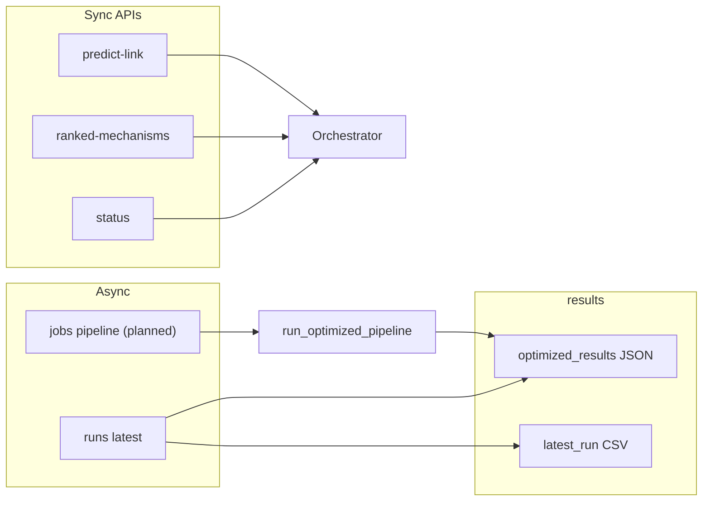

# Pipeline ↔ UI flow

How **user-facing flows** connect **full pipeline runs** (training, embeddings, ensemble) to **interactive** API features (predictions, ranking) and **artifacts** under `results/`.

## Artifact touchpoints

| Artifact | Typical producer | UI consumers (planned) |
|----------|------------------|-------------------------|
| `results/optimized_results_<timestamp>.json` | `scripts/run_optimized_pipeline.py` | Experiment overview, rankings, export |
| `results/latest_run.csv` | Pipeline / dashboard writers | Experiment overview, comparisons |
| `results/experiment_history.csv` | Pipeline / tooling | History charts, next-steps analysis |
| `results/optuna/*` | `scripts/optuna_pipeline_search.py` | Simulation / tuning views (advanced) |

Exact filenames may vary; see [../reference/EXPECTED_OUTPUTS.md](../reference/EXPECTED_OUTPUTS.md) and pipeline rules in `.cursor/rules/pipeline-scripts.mdc`.

## Flow A — Full experiment run (async)

1. User opens **Simulation control** / **Parameters** (`/simulation`, `/simulation/parameters`) — mockups: `simulation_control_panel`, `simulation_parameters`.
2. User submits parameters aligned with `run_optimized_pipeline.py` flags.
3. Backend enqueues a **job** (not implemented yet) → subprocess or worker runs the pipeline.
4. UI polls **job status** → on success, redirects or refreshes **Experiment overview** (`/experiments`).
5. Overview reads **latest** `optimized_results_*.json` via `GET /runs/latest` (implemented).

**Today:** runs are started via CLI only; the UI must either shell out through a new API or document CLI-only until the job API exists.

## Flow B — Quick prediction (sync)

1. User opens **Molecular design** or a prediction form — mockup: `molecular_design`.
2. UI calls `POST /predict-link` or `GET /predict-link` with drug + disease.
3. Response shows probability and model metadata — no full pipeline run required.

**Today:** supported by `middleware/api.py`.

## Flow C — Mechanism-informed ranking

1. User opens **New hypothesis** — mockups: `new_hypothesis_entry`, `add_new_hypothesis_form`.
2. UI calls `POST /ranked-mechanisms` with `hypothesis_id`, `disease_id`, `top_k`.
3. Results populate ranked lists; optional persistence of hypotheses is **planned**.

**Today:** ranking endpoint exists; long-term storage of user hypotheses is not defined in API yet.

## Flow D — System health

1. User opens **System status** — mockup: `system_status_details`.
2. UI calls `GET /status` for orchestrator readiness and entity count.

**Today:** supported.

## Flow E — Knowledge graph & quantum “logic” views

1. **Knowledge graph exploration** — requires endpoints or static snapshots from the KG/embedder (planned).
2. **Knowledge / quantum logic** — combine config (`quantum_config*.yaml`) and last run metrics from `results/` (planned).

## Consistency rules

- **Long-running work** must not block HTTP requests for tens of minutes; use jobs + polling or WebSockets.
- **Single source of truth** for “latest run”: prefer API that reads `results/` with explicit ordering by timestamp or manifest file.
- **CLI and UI** should share the same parameter names as `run_optimized_pipeline.py` to avoid drift.

## See also

- [MOCKUP_MAP.md](MOCKUP_MAP.md) — screen ↔ route ↔ API matrix
- [ROUTES.md](ROUTES.md) — Next.js paths
- [CONTRACTS.md](CONTRACTS.md) — request/response fields
- [ARCHITECTURE.md](ARCHITECTURE.md) — stack diagram
- [../ARCHITECTURE.md](../ARCHITECTURE.md) — KG / quantum / classical layers
