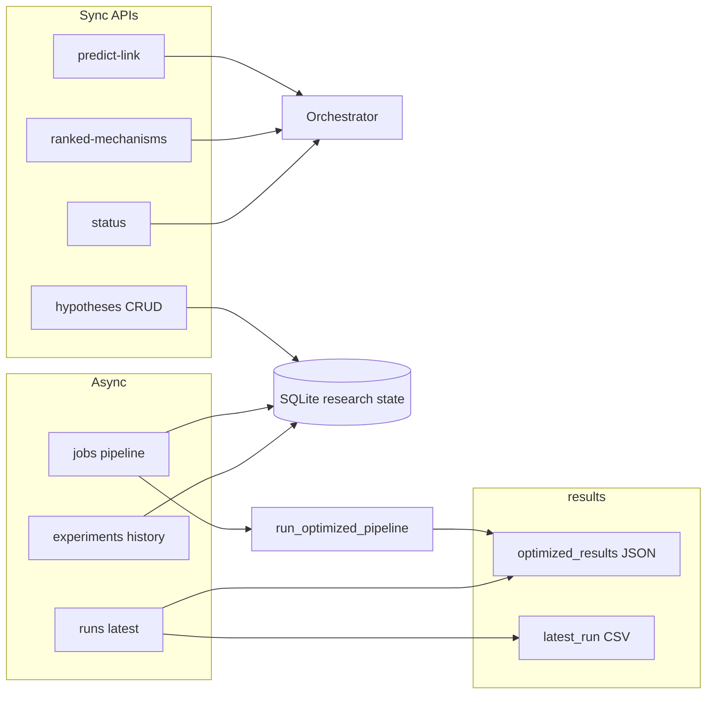

# Pipeline ↔ UI flow

How **user-facing flows** connect **full pipeline runs** (training, embeddings, ensemble) to **interactive** API features (predictions, ranking) and **artifacts** under `results/`.

## First-time user journey

For a user landing on the app with no pipeline results yet:

1. **Home** — shows the "No results" state with a primary CTA to start a job.
2. **System status** (`/system`) — verify FastAPI orchestrator is reachable and healthy.
3. **New run** (`/simulation/parameters`) — configure and submit a pipeline job.
4. **Pipeline jobs** (`/simulation`) — poll job status; job redirects here automatically on submit.
5. **Hypotheses** (`/hypotheses/new`) — select/create a hypothesis and attach disease focus/notes.
6. **Experiments** (`/experiments`) — once a job completes, view latest run metrics and experiment history.
7. **Predict treatment** (`/predict`) — run pairwise drug–disease predictions against the trained model.
8. **Visualizer** (`/visualization`) — explore charts, KG subgraph, embeddings, and the quantum circuit.

When results already exist, Home emphasizes **Predict** and **Experiments** directly, de-emphasizing the Run section.

## Artifact touchpoints

| Artifact | Typical producer | UI consumers (planned) |
|----------|------------------|-------------------------|
| `results/optimized_results_<timestamp>.json` | `scripts/run_optimized_pipeline.py` | Experiment overview, rankings, export |
| `results/latest_run.csv` | Pipeline / dashboard writers | Experiment overview, comparisons |
| `results/experiment_history.csv` | Pipeline / tooling | History charts, next-steps analysis |
| `results/optuna/*` | `scripts/optuna_pipeline_search.py` | Simulation / tuning views (advanced) |

Exact filenames may vary; see [../reference/EXPECTED_OUTPUTS.md](../reference/EXPECTED_OUTPUTS.md) and pipeline rules in `.cursor/rules/pipeline-scripts.mdc`.

## Flow A — Full experiment run (async, implemented)

1. User opens **Simulation control** / **Parameters** (`/simulation`, `/simulation/parameters`) — mockups: `simulation_control_panel`, `simulation_parameters`.
2. User submits parameters aligned with `run_optimized_pipeline.py` flags.
3. Backend enqueues a **job** via `POST /jobs/pipeline` → subprocess runs the pipeline.
4. UI polls **job status** via `GET /jobs` and `GET /jobs/{id}`.
5. Jobs persist experiment metadata (hypothesis, note, tags) in SQLite.
6. On success, users move to **Latest run & models** (`/experiments`) or **Charts & exploration** (`/visualization`).
5. Overview reads **latest** `optimized_results_*.json` via `GET /runs/latest` (implemented).

## Flow B — Quick prediction (sync)

1. User opens **Predict treatment** — canonical route `/predict`.
2. UI calls `POST /predict-link` or `GET /predict-link` with drug + disease.
3. Response shows probability and model metadata — no full pipeline run required.

**Today:** supported by `middleware/api.py`.

## Flow C — Hypothesis lifecycle + mechanism-informed ranking

1. User opens **Ranked candidates** (`/hypotheses/new`).
2. UI manages persisted hypotheses via `GET/POST/PATCH /hypotheses`.
3. UI calls `POST /ranked-mechanisms` with a saved `hypothesis_id`, `disease_id`, `top_k`.
4. Ranked rows expose in-app drill downs: predict pair, KG drill-in, chart context.
5. Hypothesis timeline reads linked runs from `GET /hypotheses/{id}/experiments`.

## Flow D — System health

1. User opens **System status** — mockup: `system_status_details`.
2. UI calls `GET /status` for orchestrator readiness and entity count.

**Today:** supported.

## Flow E — Knowledge graph & quantum views

1. **Knowledge graph exploration** uses `GET /kg/stats`, `GET /viz/kg-search`, `GET /viz/kg-subgraph`.
2. **Quantum config** uses `GET /quantum/config` and `POST /quantum/runtime/verify`.
3. **Simulator vs hardware path** is guided from `/quantum` into New run presets.

## Consistency rules

- **Long-running work** must not block HTTP requests for tens of minutes; use jobs + polling or WebSockets.
- **Single source of truth** for “latest run”: prefer API that reads `results/` with explicit ordering by timestamp or manifest file.
- **CLI and UI** should share the same parameter names as `run_optimized_pipeline.py` to avoid drift.
- **Research continuity**: every page should expose explicit next actions in the loop (run, inspect, compare, rerun).

## See also

- [MOCKUP_MAP.md](MOCKUP_MAP.md) — screen ↔ route ↔ API matrix
- [ROUTES.md](ROUTES.md) — Next.js paths
- [CONTRACTS.md](CONTRACTS.md) — request/response fields
- [ARCHITECTURE.md](ARCHITECTURE.md) — stack diagram
- [../ARCHITECTURE.md](../ARCHITECTURE.md) — KG / quantum / classical layers
